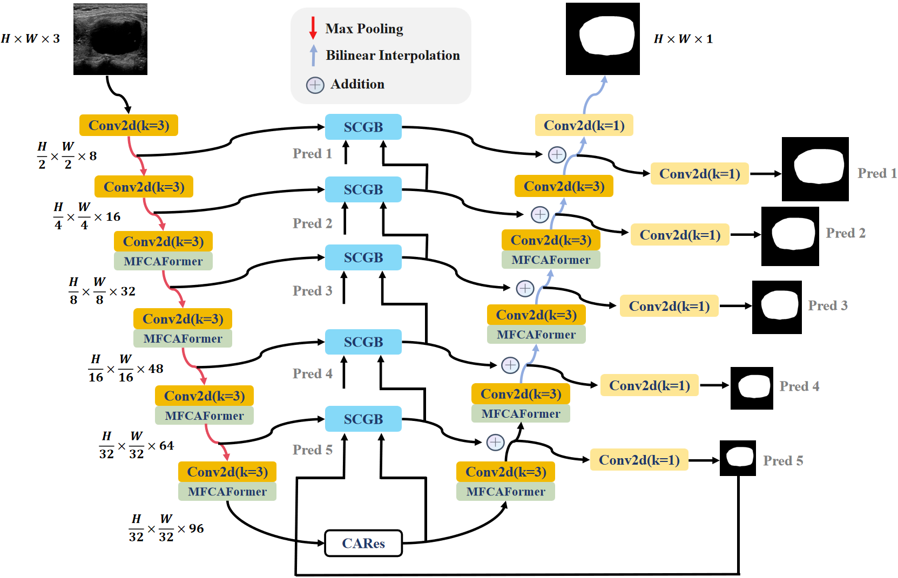

# MCS-Net

This repository is the official implementation of MCS_Net : All-round enhancements! A Light-weight UNet for Thyroid Nodule Segmentation in ultrasound images using PyTorch.




## Main Environments

- python 3.9
- pytorch 2.1.0
- torchvision 0.16.0
- For generating GradCAM results, please follow the code on this [repository](https://github.com/jacobgil/pytorch-grad-cam)


## Requirements

Install from the `requirements.txt` using:

```
pip install -r requirements.txt
```


## Prepare the dataset.

- The DDTI datasets, can be found here ([Google Drive](https://drive.google.com/file/d/1FfrVeiL7F5375BOAATz2s1J_jD-gTTbW/view?usp=drive_link))
- The TN3K datasets, can be found here ([Google Drive](https://drive.google.com/file/d/1gadDP0V0F1LGdPXsTwFbNowPbFOoCHyN/view?usp=drive_link))
- The GlaS  datasets, can be found here ([Google Drive](https://drive.google.com/file/d/1F3MA4xUWRMqXLweGu3Sw6SdA1HVX-5y6/view?usp=drive_link))
- The Chest Xray datasets, can be found here ([Google Drive](https://drive.google.com/file/d/1O0By-whbMNFQYYUQk5OHgDuZohhO0k7O/view?usp=drive_link))
- The CVC-ClinicDB datasets, can be found here ([Google Drive](https://drive.google.com/file/d/11qhaiePeOzI-wdQqwJJQ_bE8iKeSoMMZ/view?usp=drive_link))
- The Kvasir-SEG datasets, can be found ([Google Drive](https://drive.google.com/file/d/1Yz1rCYDSaDCR8WHLXCyQBdETUwM-8w_N/view?usp=drive_link))
- The ISIC2017 datasets, can be found here ([Google Drive](https://drive.google.com/file/d/1h-DnH5u2VxNLz3k4Bz8p_r5X5rQO7aHZ/view?usp=drive_link))
- The Synapse datasets, can be found ([Google Drive](https://drive.google.com/file/d/1c2oK6-LeUtrOdVNpbft5dpbatRoFrBIm/view?usp=drive_link))
- The ACDC datasets, can be found ([Google Drive](https://drive.google.com/file/d/143RaTrvLNG7g3UMSkvCb4hXvz7g8p8o1/view?usp=drive_link))

- Then prepare the datasets in the following format for easy use of the code:

```
├── datasets
    ├── DDTI
    │   ├── Test_Folder
    │   │   ├── img
    │   │   └── labelcol
    │   ├── Train_Folder
    │   │   ├── img
    │   │   └── labelcol
    │   └── Val_Folder
    │       ├── img
    │       └── labelcol
    ├── TN3k
    │   ├── Test_Folder
    │   │   ├── img
    │   │   └── labelcol
    │   ├── Train_Folder
    │   │   ├── img
    │   │   └── labelcol
    │   └── Val_Folder
    │       ├── img
    │       └── labelcol
    ├── GlaS
    │   ├── Test_Folder
    │   │   ├── img
    │   │   └── labelcol
    │   ├── Train_Folder
    │   │   ├── img
    │   │   └── labelcol
    │   └── Val_Folder
    │       ├── img
    │       └── labelcol
    └── Chest X-ray
        ├── Test_Folder
        │   ├── img
        │   └── labelcol
        ├── Train_Folder
        │   ├── img
        │   └── labelcol
        └── Val_Folder
            ├── img
            └── labelcol 
         
```


## Train the Model

First, modify the model, dataset and training hyperparameters (including learning rate, batch size img size and optimizer etc) in `Config.py`

Then simply run the training code.

```
python3 train_model.py
```


#### 2. Test the Model

Please make sure the right model, dataset and hyperparameters setting  is selected in `Config.py`. 

Then change the test_session in `Config.py` .

Then simply run the evaluation code.

```
python3 test_model.py
```


## Reference
- [UNet](https://github.com/ZJUGiveLab/UNet-Version)
- [TransUNet](https://github.com/Beckschen/TransUNet)
- [UCTransNet](https://github.com/McGregorWwww/UCTransNet)
- [ACC_UNet](https://github.com/qubvel/segmentation_models.pytorch)


