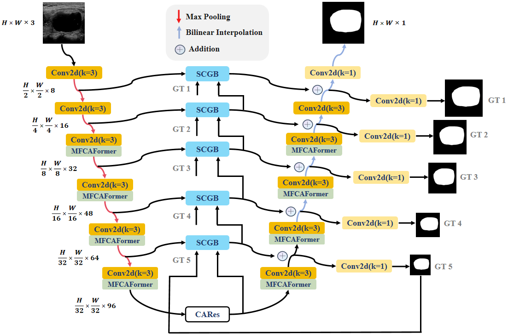

# MCS_Net

This repository is the official implementation of MCS_Net : All-round enhancements! A Light-weight UNet for Thyroid Nodule Segmentation in ultrasound images using PyTorch.




## Main Environments

- python 3.9
- pytorch 2.1.0
- torchvision 0.16.0


## Requirements

Install from the `requirements.txt` using:

```
pip install -r requirements.txt
```


## Prepare the dataset.

- The DDTI and TN3K datasets, can be found here ([GoogleDrive](https://drive.google.com/drive/folders/1za9f38XKx-VYPxxb_xx83Dpk-Wg3Yaw8?usp=sharing)), The GlaS  datasets, can be found here ([GoogleDrive](https://drive.google.com/drive/folders/1bfs6bgVM24fqyjO4aoX7ENi-1xKtNBGc?usp=sharing), The RITE datasets, can be found here ([GoogleDrive](https://drive.google.com/drive/folders/1Vofe2TSVry0FZYLNisvPKvR_67aSj0ml?usp=sharing)), divided into a 7:1:2 ratio.


- Then prepare the datasets in the following format for easy use of the code:

```
├── datasets
    ├── DDTI
    │   ├── Test_Folder
    │   │   ├── img
    │   │   └── labelcol
    │   ├── Train_Folder
    │   │   ├── img
    │   │   └── labelcol
    │   └── Val_Folder
    │       ├── img
    │       └── labelcol
    ├── TN3k
    │   ├── Test_Folder
    │   │   ├── img
    │   │   └── labelcol
    │   ├── Train_Folder
    │   │   ├── img
    │   │   └── labelcol
    │   └── Val_Folder
    │       ├── img
    │       └── labelcol
    ├── GlaS
    │   ├── Test_Folder
    │   │   ├── img
    │   │   └── labelcol
    │   ├── Train_Folder
    │   │   ├── img
    │   │   └── labelcol
    │   └── Val_Folder
    │       ├── img
    │       └── labelcol
    └── RITE
        ├── Test_Folder
        │   ├── img
        │   └── labelcol
        ├── Train_Folder
        │   ├── img
        │   └── labelcol
        └── Val_Folder
            ├── img
            └── labelcol 
         
```


## Train the Model

First, modify the model, dataset and training hyperparameters (including learning rate, batch size img size and optimizer etc) in `Config.py`

Then simply run the training code.

```
python3 train_model.py
```


## Evaluate the Model

###1. Pre-trained Models

Here, we provide pre-trained weights of on the four datasets, if you do not want to train the models by yourself, you can download them in this [Google Drive](https://drive.google.com/drive/folders/1ZYxH7EcdyIJCqw16yD9ZvwLJNfJnydP_?usp=sharing).

#### 2. Test the Model

Please make sure the right model, dataset and hyperparameters setting  is selected in `Config.py`. 

Then change the test_session in `Config.py` .

Then simply run the evaluation code.

```
python3 test_model.py
```


## Reference

- [UNet3+](https://github.com/ZJUGiveLab/UNet-Version)
- [MultiResUNet](https://github.com/makifozkanoglu/MultiResUNet-PyTorch)
- [TransUNet](https://github.com/Beckschen/TransUNet)
- [UCTransNet](https://github.com/McGregorWwww/UCTransNet)
- [ACC_UNet](https://github.com/qubvel/segmentation_models.pytorch)
- [MEW_UNet](https://github.com/JCruan519/MEW-UNet)
- [MISSFormer](https://github.com/ZhifangDeng/MISSFormer)
- [U2Net](https://github.com/NathanUA/U-2-Net)


## Citation

If you find this work useful in your research or use this dataset in your work, please consider citing the following papers:


## Contact

Yang:(1258595425yyw@gmail.com)
